## Servidores, protocolos y permisos
***

Profesores:
- Rocío Jiménez Villén
- M0wer

----

Si todavía no estás en el grupo de telegram:


---

# Índice

- Conceptos básicos:
	- Internet overview <!-- no sé cómo llamar esto -->
	- La pila de protocolos
- Despliegue de un servidor web:
	- Instalación y despliegue local de Apache
	- Redirección de puertos (NAT)
	- DNS

---

### Internet overview

- Host
- Guest
- Red
- Protocolo
- Máscara de red
- Dirección IP

----

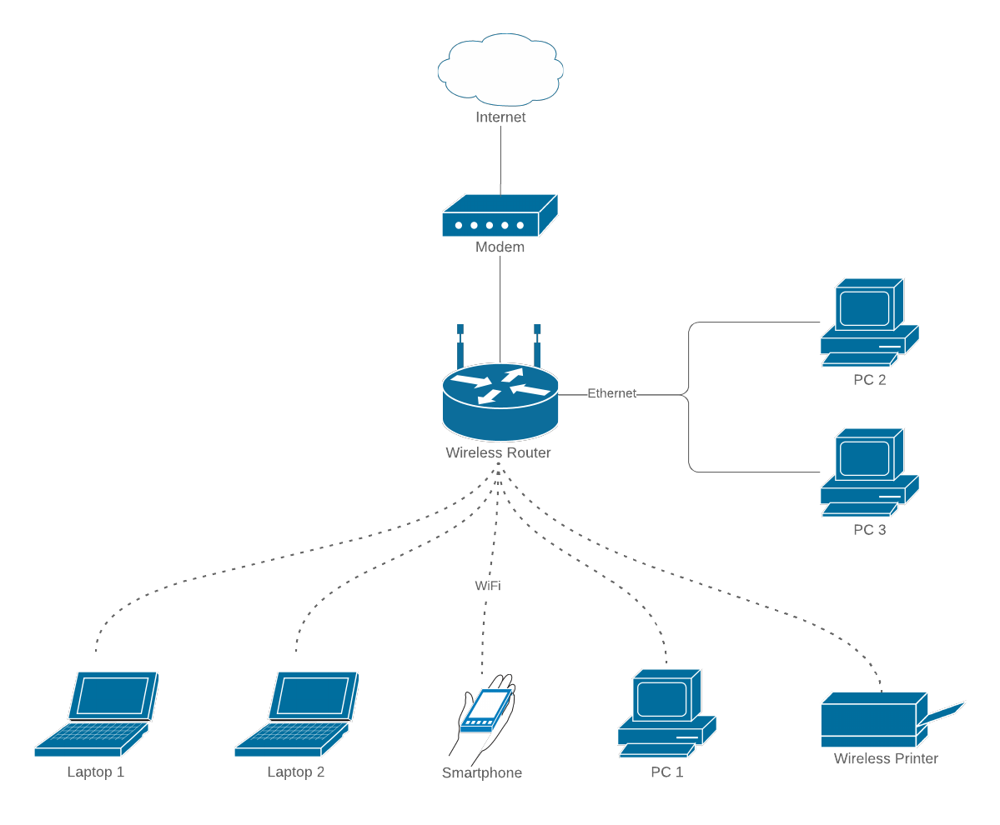 <!-- .element: width="650px" -->

----

Pila de protocolos (Internet)


---

## ¡Manos a la obra!
*1º Instalar Apache, php y mysql*

```console[1|2]
rjvillen@Linx:~$ sudo apt install lamp-server
rjvillen@Linx:~$ sudo apt install apache2
```
----
<div>

```console
rjvillen@Linx:~$ cd ..
rjvillen@Linx:/home$ cd ..
rjvillen@Linx:/$ cd var/www/html
rjvillen@Linx:/var/www/html$ ls
index.html
rjvillen@Linx:/var/www/html$ cat index.html
<h1> Vuestro pimer server :)) oleee <h1> 

```

</div>

<div>

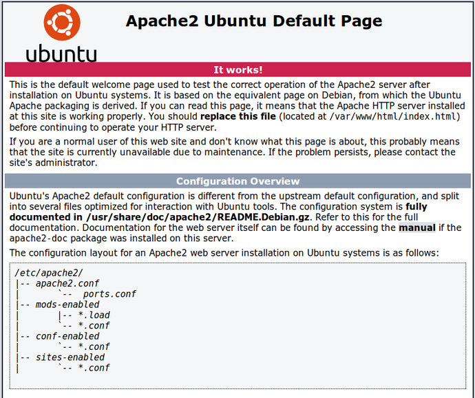 <!-- .element: width="450px" -->

</div>

---

## ¡Manos a la obra!
*2º Descubir nuestra IP y asignar una IP fija*

----

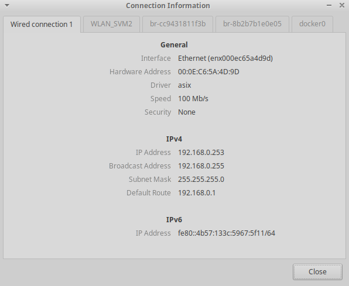

----

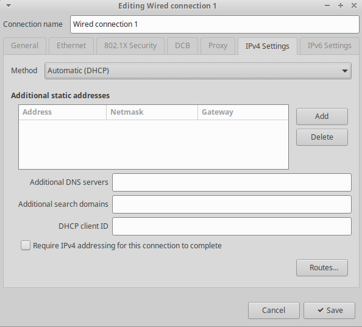

----

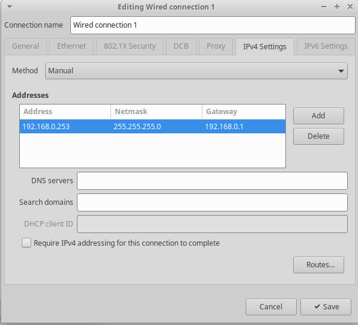

---

## ¡Manos a la obra!
*3º Redirección de puertos con NAT*

----
### NAT = Network Address Translation

- No hay suficientes direcciones IPv4
- Nuestra dirección IP no es visible desde el exterior de la red (IP privada)

----
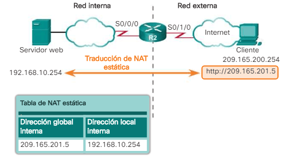

----
Entrar en nuestro router para configurar el NAT
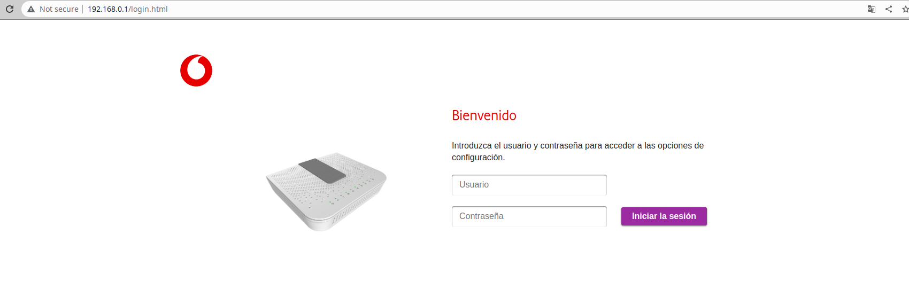

----
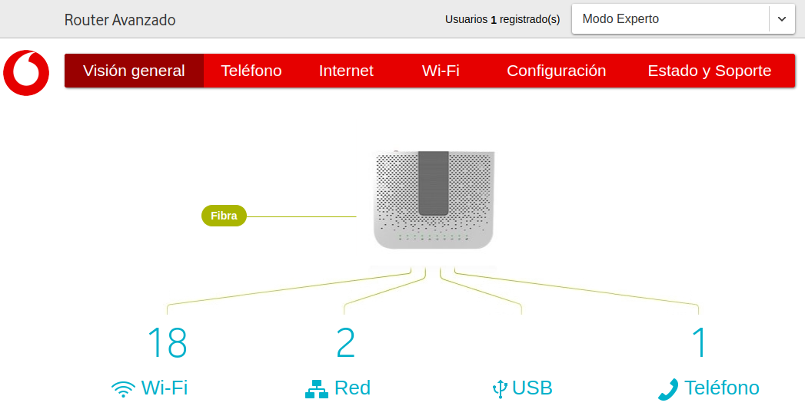

----
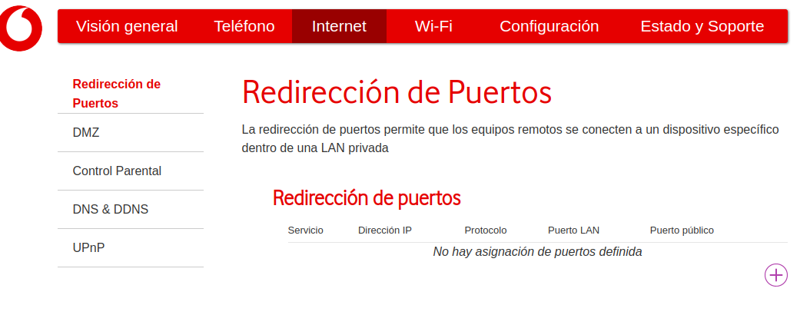

----
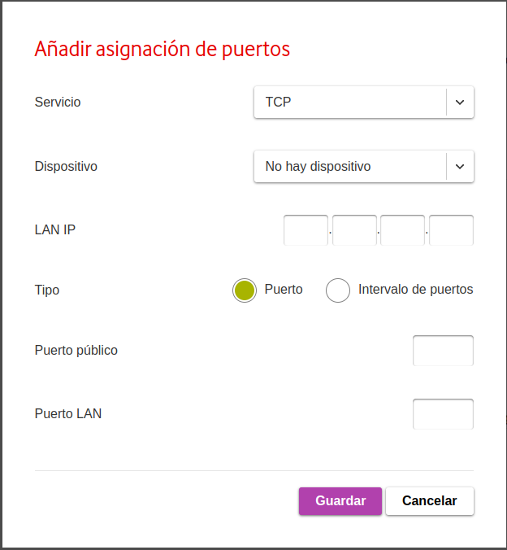 <!-- .element: width="450px" -->

----
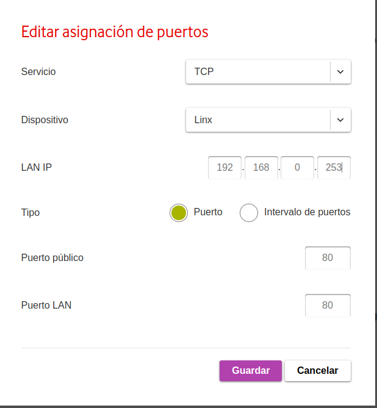 <!-- .element: width="450px" -->

---

## ¡Manos a la obra!
*4º Configurar un DNS*

----

<div id='left'>
<span id='bright'>46.89.167.2</span>

- Difícil de leer y recordar
- No quiero dar mi IP pública >:(
</div>

<div id='right'>
<span id='bright'>myhouse.crabdance.com</span>

- Fácil de leer y recordar :D
- Siempre apunta a mi servidor
</div>

----
Para crearos un subdominio gratuito:
https://freedns.afraid.org/

----

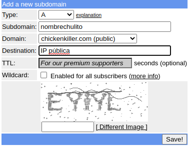 <!-- .element: width="450px" -->

----
Instalar un cliente de dynamic dns

```console[1|2]
rjvillen@Linx:~$ sudo apt install ddclient
rjvillen@Linx:~$ sudo nano /etc/ddclient.conf
```
----

/etc/ddclient.conf

```
# Configuration file for ddclient generated by debconf
# /etc/ddclient.conf
daemon=5
timeout=10

use=if, if=eth0
server=freedns.afraidof.org
protocol=freedns
login=rjvillen
#usuario en freedns.afraid.org 
password='vuestra constraseña de freedns.afraid.org'
syslog=yes
verbose=yes
rjvillen.crabdance.com 
#nombre del subdominio
```
----
```Console[8]
# Configuration for ddclient scripts 
# generated from debconf on sáb 12 nov 2022 20:25:49 CET
#
# /etc/default/ddclient

# Set to "true" if ddclient should be run every time DHCP client ('dhclient'
# from package isc-dhcp-client) updates the systems IP address.
run_dhclient="true"

# Set to "true" if ddclient should be run every time a new ppp connection is 
# established. This might be useful, if you are using dial-on-demand.
run_ipup="false"

# Set to "true" if ddclient should run in daemon mode
# If this is changed to true, run_ipup and run_dhclient must be set to false.
run_daemon="true"

# Set the time interval between the updates of the dynamic DNS name in seconds.
# This option only takes effect if the ddclient runs in daemon mode.
daemon_interval="300"
```
---

 <!-- .element: width="600px" -->

---
**¡Muchas gracias!**


*No olvidéis dejarnos vuestro feedback <3*

---

<style>

#bright {
  color: deeppink;
}

#left {
	margin: 10px 0 15px 20px;
	text-align: center;
	float: left;
	z-index:-10;
	width:48%;
	font-size: 0.85em;
	line-height: 1.5;
}

#right {
	margin: 10px 0 15px 0;
	float: right;
	text-align: center;
	z-index:-10;
	width:48%;
	font-size: 0.85em;
	line-height: 1.5;
}

</style>
